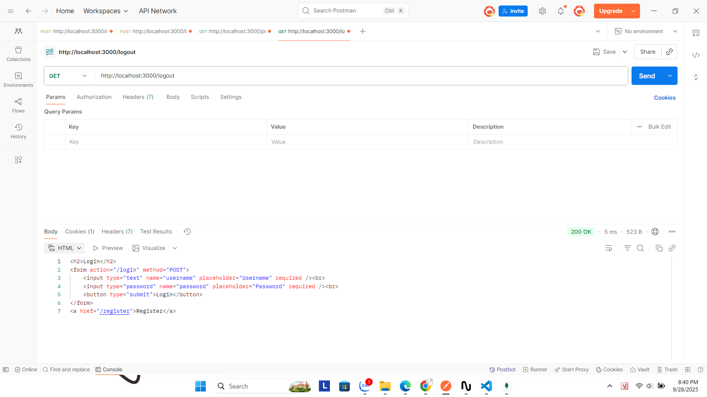

# Local Passport Authentication Project

## Giới thiệu
Dự án này minh họa cách sử dụng **Express.js** và **Passport.js** để thực hiện chức năng **đăng ký, đăng nhập, hiển thị thông tin người dùng, và đăng xuất**.  
Người dùng được lưu trong **MongoDB**, và các route được bảo vệ bằng middleware `isAuthenticated`.

## Cài đặt

### 1. Clone source
```bash
git clone <repository-url>
cd <project-folder>
````

### 2. Cài dependencies

```bash
npm install
```

### 3. Chạy server

```bash
node app.js
```

Mặc định server chạy tại:

```
http://localhost:3000
```

---

## Cấu trúc chính

* `routes/` : chứa các router (`register`, `login`, `profile`, `logout`)
* `models/User.js` : model của người dùng
* `views/` : các view `register.ejs`, `login.ejs`, `profile.ejs`
* `public/results/` : chứa hình test kết quả Postman

---

## Các chức năng

### 1. Register

* Route: `GET /register` và `POST /register`
* Cho phép người dùng đăng ký tài khoản mới


* Sau khi đăng ký, có thể kiểm tra dữ liệu đã lưu trong MongoDB:
  

---

### 2. Login

* Route: `GET /login` và `POST /login`
* Xác thực người dùng qua **Passport Local Strategy**


* Sau khi login, cookie lưu trong Postman:
  

---

### 3. Profile (Protected Route)

* Route: `GET /profile`
* Chỉ truy cập được khi đã login


---

### 4. Logout

* Route: `GET /logout`
* Xoá session, redirect về trang login



---

## Middleware

* `isAuthenticated(req, res, next)` : bảo vệ route `/profile`

---

## Kết luận

Dự án này đã hoàn chỉnh các chức năng cơ bản:

* Đăng ký
* Đăng nhập
* Bảo vệ route
* Đăng xuất
